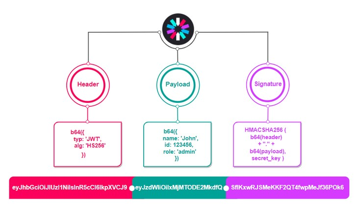
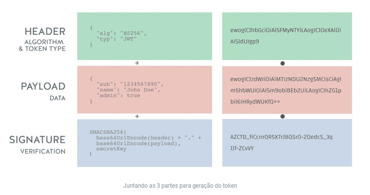

# JWT - JSON Web Token

[Página do JWT.io](https://jwt.io/)

<br>

## O que é ?

O JSON Web Token (JWT) é um padrão aberto (RFC 7519) para representar informações seguras entre duas partes. Ele é um formato compacto e autossuficiente para transmitir informações entre as partes de uma forma segura e verificável. Ele é geralmente utilizado para autenticação e autorização em aplicações web e APIs RESTful.

### Representação JWT



<br>

<br>

### Estudos das partes do JWT

Um JWT é composto de três partes separadas por pontos ".":

`Header`
Contém informações sobre o tipo de token e o algoritmo de criptografia usado para assinar o token.
```json
{
"alg": "HS256",
"typ": "JWT"
}
```

<br>

`Payload` 
É o corpo do token, que contém as informações do usuário ou outros dados a serem transmitidos. As informações do payload são codificadas em JSON e podem incluir informações como o ID do usuário, nome, endereço de e-mail, tempo de expiração e outras informações personalizadas.

```json
{
  "sub": "jo",
  "name": "Josué B. Almeida",
  "roles": ["USERS","MANAGERS"]
}
```

<br>

`Assinatura` 
É a parte final do token e é usada para verificar se o token é autêntico e não foi modificado durante a transmissão. A assinatura é criada usando a chave secreta do servidor, que somente o servidor possui.



<br>

<br>

### Como funciona ?

- Quando um usuário faz login em uma aplicação, a aplicação pode gerar um JWT para o usuário, que contém informações de identificação e autorização. O token é então enviado para o cliente e armazenado, geralmente em um cookie ou no armazenamento local do navegador. Quando o usuário faz uma solicitação para um recurso protegido, o token é enviado para o servidor, que verifica a autenticidade do token e a autorização do usuário antes de conceder o acesso ao recurso solicitado.
- O uso de JWTs é conveniente e seguro porque os tokens são autossuficientes e compactos, podem ser facilmente transmitidos em um cabeçalho HTTP ou em um corpo de requisição JSON e podem ser validados sem precisar de uma consulta de banco de dados para verificar se o usuário está autenticado ou autorizado. Além disso, eles podem ser usados em ambientes de microsserviços, onde a autenticação e autorização precisam ser distribuídas e escaláveis.