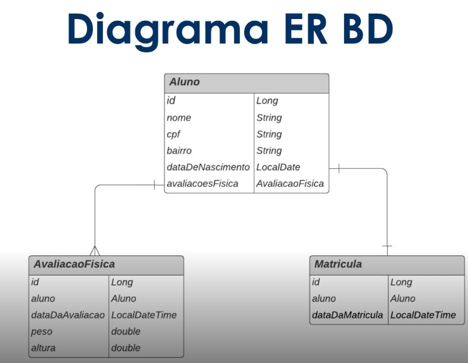
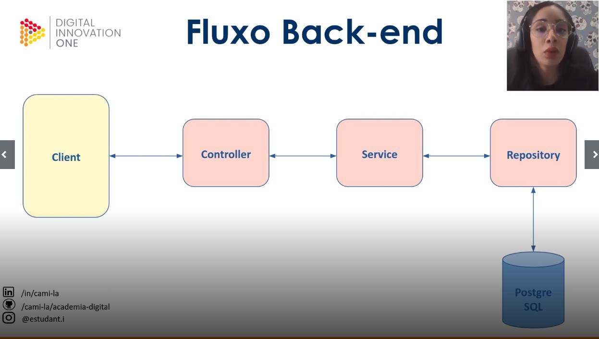

# Projeto: Conhecendo o Spring Data JPA na prática com Java

## Objetivo do projeto

Ao final desse projeto, o Dev irá conhecer os principais conceitos de mapeamento de objeto relacional (ORM) usando o Spring Data JPA. Para isso, uma API RESTful será desenvolvida com ênfase na modelagem de suas entidades, no domínio de uma academia de ginástica.

### Representação das tabelas:

 

 

#### Slides do curso:
[Slides da Cami](/Arquivos/Conteudo/6%20-%20Ganhando%20produtividade%20com%20spring%20framwork/Material/Spring%20Data%20JPA/Spring%20Data%20JPA.pptx.pdf)

 

---

### Meu projeto
[Arquivos](/Arquivos/Conteudo/6%20-%20Ganhando%20produtividade%20com%20spring%20framwork/Codigo/Academia%20digital/)

 

##### Para acessaro o swagger:
http://localhost:8080/swagger-ui/index.html