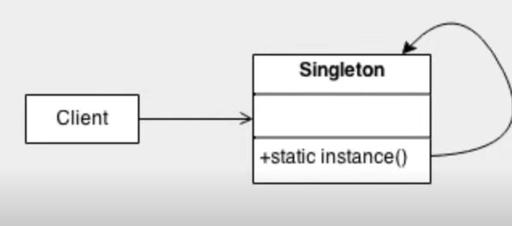
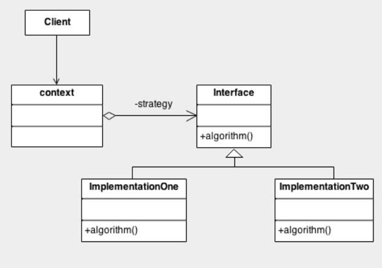
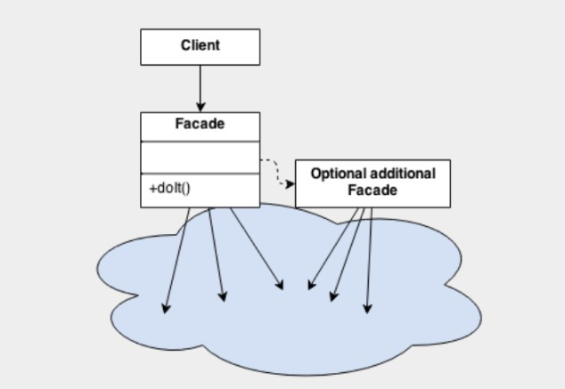

# Introdução

## Padrões de projetos

São soluções consolidadas para problemas recorrentes no desenvolvimento e manutenção de software orientado a objetos.**

O livro **Design Patterns: Elements of Reusable Object-Oriented Software (1995)**  é a principal referência sobre o tema, a qual tornou os autores **Gamma**, **Helm** ,**Johnson** e **Vlissides** conhecidos como **“Gang of Four” (GoF).**

### São comumente classificados nas seguintes categorias:

- **Padrões Criacionais:** Abstract Factory, Builder, Factory Method, Prototype, Singleton*.
- **Padrões Comportamentais:** Chain of Responsibility, Iterator, Observer, Strategy, Template Method.
- **Padrões Estruturais**: Adapter, Bridge, Composite, Decorator, Facade Flyweight, Proxy.

 

## Abordando os padrões mais usados:

### Singleton

**Padrão Criacional**
Permitir a criação de uma única instância de uma classe e fornecer um modo para recuperá-la.

 

 

### Strategy

**Padrão Comportamental**
Simplificar a variação de algoritmos para a resolução de um mesmo problema.

 

 

### Facade

**Padrão Estrutural**
Prover uma interface que reduza a complexidade nas integrações com subsistemas.

 

 

 

[Voltar a Explorando padrões de projetos na prática com Java](/Arquivos/Conteudo/6%20-%20Ganhando%20produtividade%20com%20spring%20framwork/6.7%20Projeto%20explorando%20padroes%20de%20projeto%20na%20pratica.md) 
[Voltar ao inicio](/README.md)