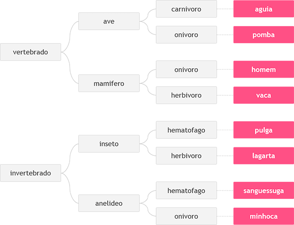

# Desafio animal 

## DESAFIO

Neste problema, você deverá ler 3 palavras que definem o tipo de animal possível segundo o esquema abaixo, da esquerda para a direita. Em seguida conclua qual dos animais seguintes foi escolhido, através das três palavras fornecidas.



<br>

### Entrada

A entrada contém 3 palavras, uma em cada linha, necessárias para identificar o animal segundo a figura acima, com todas as letras minúsculas.

### Saída

Imprima o nome do animal correspondente à entrada fornecida.

| Exemplos de Entrada | Exemplos de Saída |
| --- | --- |
| vertebrado | homem |
| mamifero |  |
| onivoro |  |

| Exemplos de Entrada | Exemplos de Saída |
| --- | --- |
| vertebrado | aguia |
| ave |  |
| carnivoro |  |

| Exemplos de Entrada | Exemplos de Saída |
| --- | --- |
| invertebrado | minhoca |
| anelideo |  |
| onivoro |  |

<br>

### Dicas para resolução:
1. O programa usa a classe Scanner para ler a entrada do usuário a partir do console.
2. O programa define três variáveis AN1, AN2 e AN3 para armazenar as três palavras inseridas pelo usuário.
3. O programa usa a estrutura condicional if-else para classificar o animal com base nas três palavras inseridas pelo usuário.
4. O primeiro nível da estrutura condicional if-else verifica se a primeira palavra é "vertebrado" ou "invertebrado".
5. O segundo nível da estrutura condicional if-else verifica se a segunda palavra é "ave" ou "mamifero" (se a primeira palavra é "vertebrado") ou "inseto" ou "anelideo" (se a primeira palavra é "invertebrado").
6. O terceiro nível da estrutura condicional if-else verifica se a terceira palavra é "carnivoro", "onivoro" ou "herbivoro" (se a primeira palavra é "vertebrado" e a segunda palavra é "ave"), "onivoro" ou "herbivoro" (se a primeira palavra é "vertebrado" e a segunda palavra é "mamifero"), "hematofago" ou "herbivoro" (se a primeira palavra é "invertebrado" e a segunda palavra é "inseto"), ou "hematofago" ou "onivoro" (se a primeira palavra é "invertebrado" e a segunda palavra é "anelideo").
7. Com base na combinação de palavras, o programa imprime o nome do animal correspondente.

---

<details>
<summary>Código com resolução:</summary>

```java
// Para ler e escrever dados em Java, aqui na DIO padronizamos da seguinte forma:
// - new Scanner(System.in): cria um leitor de Entradas, com métodos úteis com prefixo "next";
// - System.out.println:.imprime um texto de Saída (Output) e pulando uma linha.

import java.io.IOException;
import java.util.Scanner;

public class Main {
    public static void main(String[] args) {
        Scanner sc = new Scanner(System.in);

        String AN1, AN2, AN3;

        AN1 = sc.nextLine();
        AN2 = sc.nextLine();
        AN3 = sc.nextLine();

        if (AN1.equals("vertebrado") && AN2.equals("ave")) {
            if (AN3.equals("carnivoro")) {
                System.out.println("aguia");
            } else if (AN3.equals("onivoro")) {
                System.out.println("pomba");
            }
        } else if (AN1.equals("vertebrado") && AN2.equals("mamifero")) {
            if (AN3.equals("onivoro")) {
                System.out.println("homem");
            } else if (AN3.equals("herbivoro")) {
                System.out.println("vaca");
            }
        } else if (AN1.equals("invertebrado") && AN2.equals("inseto")) {
            if (AN3.equals("hematofago")) {
                System.out.println("pulga");
            } else if (AN3.equals("herbivoro")) {
                System.out.println("lagarta");
            }
        } else if (AN1.equals("invertebrado") && AN2.equals("anelideo")) {
            if (AN3.equals("hematofago")) {
                System.out.println("sanguessuga");
            } else if (AN3.equals("onivoro")) {
                System.out.println("minhoca");
            }
        }
    }
}
```

</details>
